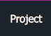

Exception handling has many advantages over return-value-based error reporting. Good framework design helps the application developer realize the benefits of exceptions. This section discusses the benefits of exceptions and presents guidelines for using them effectively.

# In This Section

* [Exception Throwing](ExceptionThrowing.md)
* [Using Standard Exception Types](UsingStandardExceptionTypes.md)
* [Exceptions and Performance](ExceptionsAndPerformance.md)

# See also
​
Other Resources

* [Framework Design Guidelines](FrameworkDesignGuidelines.md)

______________________________________________________________________________________________

© 2018 Gammasoft.
