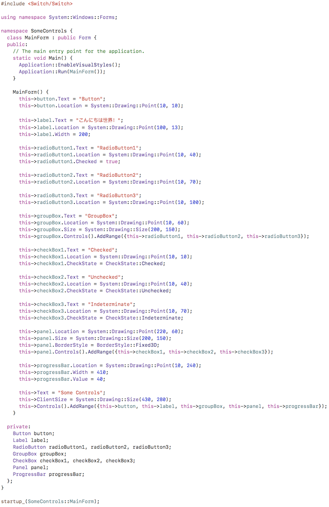
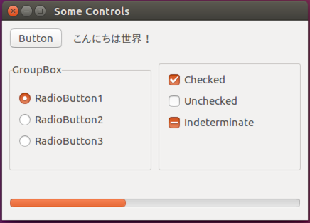

[SomeControl Code](https://github.com/gammasoft71/Switch/tree/master/Examples/Forms/SomeControls)

[SomeControl Windows](https://github.com/gammasoft71/Switch/tree/master/Examples/Forms/SomeControls)

[SomeControl macOS](https://github.com/gammasoft71/Switch/tree/master/Examples/Forms/SomeControls)

[SomeControl Ubuntu](https://github.com/gammasoft71/Switch/tree/master/Examples/Forms/SomeControls)

[Calculator](https://github.com/gammasoft71/Switch/tree/Release-0.1.0/Examples/Forms/Calculator)

[Sudoku](https://github.com/gammasoft71/Switch/tree/Release-0.1.0/Examples/Forms/Sudoku)

[Switch](https://gammasoft71.wixsite.com/switch)

[Gammasoft](https://gammasoft71.wixsite.com/gammasoft)

______________________________________________________________________________________________

© 2018 Gammasoft.
