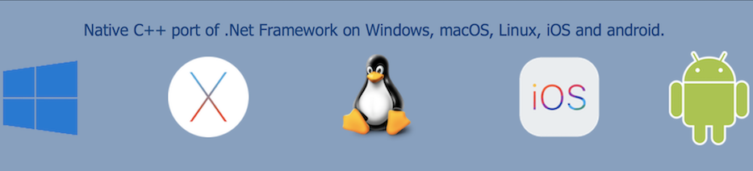
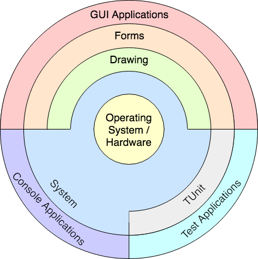

# The Switch framework is...
- a collection of native C++ classes libraries, similar to the .NET Framework;
- written in efficient, modern C++14;
- and highly portable and available on many different platforms (Windows, Mac Os X, Linux);

# Switch is composed of several libraries

These libreries are grouped by theme :

- **System** : The *Switch.Core*, *Switch.System* and *Switch.System.Core* libraries are libraries of classes, interfaces, and value types that provide access to system functionality. It is the foundation on which c++ applications, components, and controls are built.
- **Drawing** : The *Switch.System.Drawing* library contains types that support basic GDI+ graphics functionality. Child namespaces support advanced two-dimensional and vector graphics functionality, advanced imaging functionality, and print-related and typographical services. A child namespace also contains types that extend design-time user-interface logic and drawing.
- **Forms** : The *Switch.System.Windows.Forms* library contains classes for creating Windows-based applications that take full advantage of the rich user interface features available in the Microsoft Windows operating system.
- **TUnit** : The *Switch.TUnit.Core* and *Switch.Tunit.Main* libraries are a unit-testing framework for modern C++14. Initially ported from NUnit.

See [Switch libraries hierarchy](Libraries.md).

# Objectives and Mission
- **Switch** is a powerful, yet easy to use platform to build your applications upon
- **Switch** allows you to build highly portable applications (write once – compile and run anywhere)
- **Switch** is modular and scalable from embedded applications
- **Switch** provides consistent, comprehensive and comprehensible programming interfaces
- **Switch** favors simplicity over complexity ("as simple as possible, but not simpler")
- **Switch** aims for consistency in design, coding style and documentation
- **Switch** emphasizes source code quality, in terms of readability, comprehensiveness, consistency, style and testability
- **Switch** aims to make C++ programming fun again Guiding Principles
- Strong focus on code quality, style, consistency and code readability –all code must satisfy our coding style guide
- Strong focus on tests (automated unit tests with high coverage)
- Build on top of solid foundations – use existing proven C libraries (e.g. Curl, rs232, zlib,...) where it makes sense

______________________________________________________________________________________________

© 2010 - 2018 by Gammasoft.
