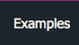

Because localizable resources can be referenced via certain objects as if they were properties, the naming guidelines for resources are similar to property guidelines.

**√ DO** use PascalCasing in resource keys.

**√ DO** provide descriptive rather than short identifiers.

**X DO NOT** use language-specific keywords of the C++ languages.

**√ DO** use only alphanumeric characters and underscores in naming resources.

**√ DO** use the following naming convention for exception message resources.

The resource identifier should be the exception type name plus a short identifier of the exception:

**ArgumentExceptionIllegalCharacters**

**ArgumentExceptionInvalidName**

**ArgumentExceptionFileNameIsMalformed**

# See also
​
Other Resources

* [Framework Design Guidelines](FrameworkDesignGuidelines.md)
* [Naming Guidelines](NamingGuidelines.md)

______________________________________________________________________________________________

© 2018 Gammasoft.
