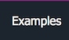

Protected members by themselves do not provide any extensibility, but they can make extensibility through subclassing more powerful. They can be used to expose advanced customization options without unnecessarily complicating the main public interface.

Framework designers need to be careful with protected members because the name "protected" can give a false sense of security. Anyone is able to subclass an unsealed class and access protected members, and so all the same defensive coding practices used for public members apply to protected members.

**✓ CONSIDER** using protected members for advanced customization.

**✓ DO** treat protected members in unsealed classes as public for the purpose of security, documentation, and compatibility analysis.

Anyone can inherit from a class and access the protected members.

# See also
​
Other Resources

* [Framework Design Guidelines](FrameworkDesignGuidelines.md)
* [Designing for Extensibility](DesigningForExtensibility.md)

______________________________________________________________________________________________

© 2010 - 2018 by Gammasoft.
