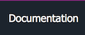

# Status information

 Not applicable

 Not started

 Started

 In progress

 Usable

 Complete

# The Switch libraries status

| Library                                                                                      | Status                                |
|----------------------------------------------------------------------------------------------|---------------------------------------|
| [Switch.Core (mscorelib)](SwitchCoreStatus.md)                                               |   |
| [Switch.ISymWrapper (ISymWrapper)](SwitchISymWrapperStatus.md)                               |    |
| [Switch.PresentationFramework (PresentationFramework)](SwitchPresentationFrameworkStatus.md) |    |
| [Switch.System (System)](SwitchSystemStatus.md)                                              |   |
| [Switch.System.Core (System.Core)](SwitchSystemCoreStatus.md)                                |   |
| [Switch.System.Drawing (System.Drawing)](SwitchSystemDrawingStatus.md)                       |   |
| [Switch.System.Globalization (sysglobl)](SwitchSystemGlobalizationStatus.md)                 |    |
| [Switch.System.ServiceModel (System.ServiceModel)](SwitchSystemServiceModelStatus.md)        |   |
| [Switch.System.Windows.Forms (System.Windows.Forms)](SwitchSystemWindowsFormsStatus.md)      |   |
| [Switch.WindowsBase (WindowsBase)](SwitchWindowsBaseStatus.md)                               |    |

______________________________________________________________________________________________

© 2018 Gammasoft.
