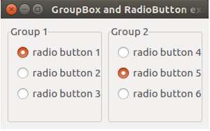
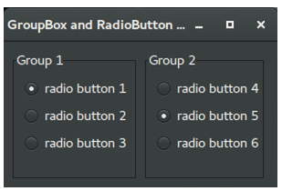

# GroupBoxAndRadioButton

This example demonstrates the use of 
System::Windows::Forms::GroupBox and System::Windows::Forms::RadioButton controls.

Windows :

macOS :

Ubuntu :

Gnome :

Gnome Dark :

