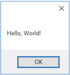
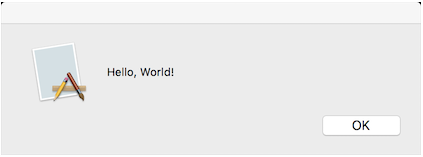

# Action2

This example simplifies this code by instantiating the Action<T> delegate instead of explicitly defining a new delegate and assigning a named method to it.

If Action2 is called without param

## Output

```
Hello, World!
```

If Action2 is called with any param

## Result



Windows



macOS


Ubuntu
