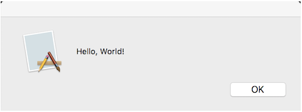
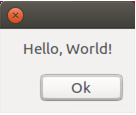

# Action3

This example simplifies this code by instantiating the Action<T> delegate instead of explicitly defining a new delegate and assigning a named method to it.

If Action3 is called without param

## Output

```
Hello, World!
```

If Action3 is called with any param

## Result


Windows



macOS



Ubuntu
